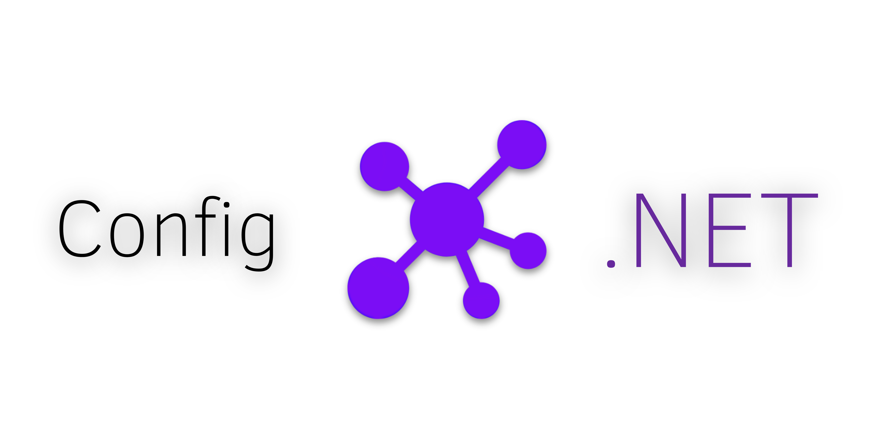

# ConfigDotNet




# What is ConfigDotNet?
###### The repo provides a convenient way to work with configurations

## Features

- Projecting a config onto classes and vice versa
- Interfaces allow you to build a single code base
- Immutability, thread safety and fastness

## Coming soon

- Ability to work with files (xml, json and txt).
- Specialized classes for obtaining specific data from a file (database configuration, programs, etc.)

## Installation

Requires .NET 7+ to use

## How it works

We will create `Configuration<T>` which contains key value pairs (string - T) 
using: 
- an object derived from `IDictionry<string, Т>`,
- two `IEnumerable<Т>` objects representing collections of keys and values,
- a collection of specialized classes `Section<Т>`.

#### Example (C#):
```CSharp
var config = new Configuration<int>(dict); // dicts type is Dictionary<string, int>
var config = new Configuration<int>(keys, values); // keys is List<string>, values is IEnumerable<int>
var config = new Configuration<int>(sections); // sections is IEnumerable<Section<int>>
```

#### Model mapping:

#### Example (C#):

- TestModel.cs
```CSharp
using ConfigDotNet.ObjectModel;

// Model should have a constructor without parameters
[ConfigurationModel<int>] // Marks that all section should be Int32 type
public class Model
{
    // Member of model with SectionAttribute shouldn't be a readonly
    [Section("A")] public int A; // You need to define the section name for the fields explicitly
    [Section] public int B { get; set; } // If the name is not specified explicitly, 
                                         //the property name will be used by default
    [Section("D")] public int C { get; set; } // You can change the section name
}
```
- Program.cs
```CSharp
using ConfigDotNet.ObjectModel;
using ConfigDotNet;

var dict = new Dictionary<string, int>()
{
    { "A", 1 },
    { "B", 2 },
    { "D", 3 }
};

var config = new Configuration<int>(dict);

Model model = ConfigurationMapper.MapToModel<Model, int>(config);
Configuration<int> configOnModel = ConfigurationMapper.MapToConfig<Model, int>(config);

Assert.Debug(config == configOnModel); // expression is true
```

## License

ConfigDotNet is licensed under the [MIT](LICENSE.TXT) license.

**Free Software, Hell Yeah!**
